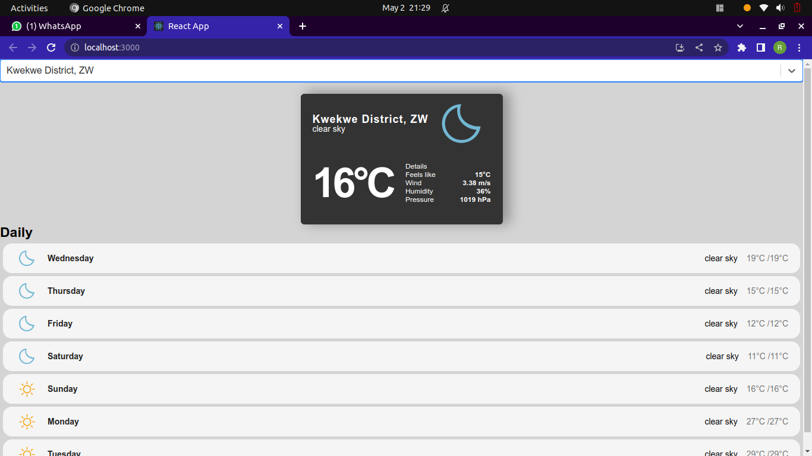

# Weather App

This is a simple weather application built using React.js and the OpenWeather API. It allows users to search for weather information of different locations and provides current weather data including temperature, humidity, wind speed, and a brief description of the weather condition.



## Features

- Search for weather information of any location
- Display current temperature, humidity, wind speed, and weather condition
- Dynamically updates weather data based on the searched location
- Responsive design for optimal user experience on different devices

## Technologies Used

- React.js: A JavaScript library for building user interfaces
- OpenWeather API: Provides access to weather data and forecasts

## Installation

1. Clone the repository:

```
git clone https://github.com/RobertMudzonga/weather_app.git
```

2. Change to the project directory:

```
cd weather_app
```

3. Install the dependencies:

```
npm install
```

4. Obtain an API key from the [OpenWeather API](https://openweathermap.org/).

5. Create a `.env` file in the root directory of the project and add the following line, replacing `{YOUR_API_KEY}` with your actual API key:

```
REACT_APP_API_KEY={YOUR_API_KEY}
```

6. Start the application:

```
npm start
```

7. Open your web browser and navigate to `http://localhost:3000` to see the Weather App in action.

## Usage

1. Enter the name of a city or location in the search bar.

2. Press the "Enter" key or click the search button.

3. The app will display the current weather information for the entered location.

4. To search for weather information for a different location, repeat steps 1 to 3.

## Contributing

Contributions are welcome! If you find any issues or have suggestions for improvements, please open an issue or submit a pull request.

## License

This project is licensed under the [MIT License](LICENSE).

## Acknowledgements

- This app utilizes the [OpenWeather API](https://openweathermap.org/) for weather data.
- Thanks to the developers of React.js and its various libraries for providing an excellent framework for building user interfaces.
